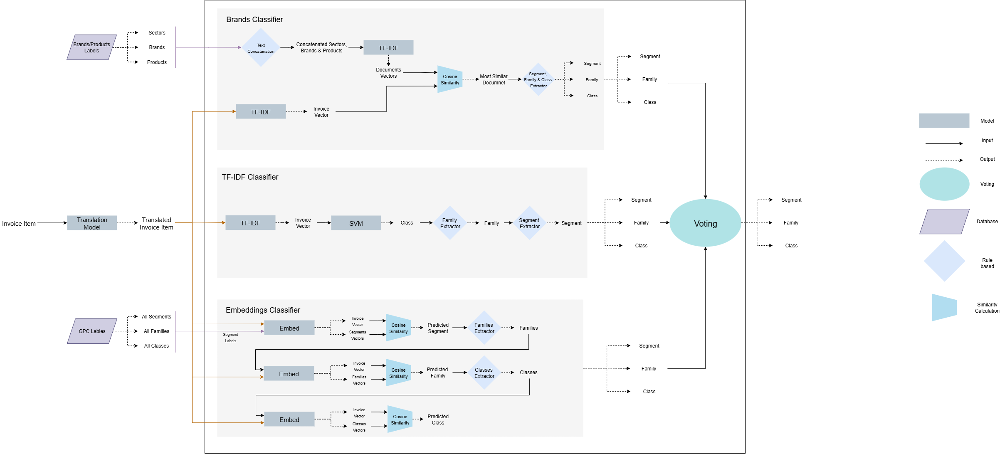

# Prodify+
AI-Powered Invoice Product Classification System

## Overview

Prodify+ is an AI learning system for classifying invoice products into the first three Global Product Classification (GPC) levels: Segment, Family, and Class. The system leverages an ensemble approach combining three distinct AI models to achieve high accuracy in product categorization for invoice processing and business intelligence applications.

### Key Features

- **Multi-model Ensemble Architecture**: Combines brand similarity, traditional classification, and embedding-based models
- **High Accuracy Performance**: Achieves 96.1% accuracy at segment level, 94.0% at family level, and 93.2% at class level
- **Interactive Web Interface**: Streamlit-based application for real-time product classification
- **Scalable Pipeline**: Batch processing capabilities for large datasets
- **GPC Standard Compliance**: Follows Global Product Classification standards for consistent categorization

## Powerpoint Presentaion

For a more comprehensive overview of the Prodify+ system, including architecture diagrams, performance metrics, and technical details, view our powerpoint presentation:

**[Google Slides - PowerPoint Presentation](https://docs.google.com/presentation/d/1pgG_iw8QQXiTe2UU_AfXQjz3OF5Dd3iP/edit?usp=sharing&ouid=106564138256942859967&rtpof=true&sd=true)**

## Technology Stack

- **Frontend**: Streamlit - Interactive web application framework
- **Backend**: Python 3.12 - Core application logic and model orchestration
- **AI Models**: 
  - E5 Large Instruct - For semantic embeddings and similarity matching
  - TF-IDF + SVM - For traditional text classification
  - Cosine Similarity - For brand matching and similarity calculations
- **Deep Learning**: PyTorch 2.7.1 - Model loading and tensor operations
- **Database**: Teradata - Enterprise data warehouse integration
- **Model Optimization**: Transformers, sentence-transformers - For efficient model inference
- **Data Processing**: pandas, scikit-learn - For data manipulation and ML utilities

## Architecture



The Prodify system consists of two main pipelines that utilizies three components:

### Model Components

#### 1. Brand Similarity Model
- Calculates TF-IDF vectors for invoice products against a curated brands dataset (87 brands with top 20 products each)
- Uses cosine similarity to find the most similar brand-product concatenation
- Returns GPC classification based on the matched brand-product pair

#### 2. TF-IDF Classifier Model  
- Traditional machine learning pipeline combining TF-IDF vectorization with SVM classification
- Trained on a 50K + dataset

#### 3. Embedding-Based Model
- Utilizes E5 Large Instruct model for semantic understanding
- Hierarchical classification approach: predicts segment first, then family, then class

### Pipeline Architecture

**Training Pipeline**: Processes training data to build and train the tf-idf models, saving the trained components as serialized files (`tfidf_similarity.joblib`, `tfidf_svm.joblib`) in the `models/` directory.

**Inference Pipeline**: Loads the pre-trained models from the `models/` directory and combines predictions from all three components through a voting mechanism to produce final classifications with confidence scores.

### Pre-trained Model Files

- **Pre-trained Models**: [Google Drive - Models](https://drive.google.com/drive/folders/1fKKW8ir-ek0dFyWtOejbDorq8FcD7hEw?usp=sharing)
  - `tfidf_similarity.joblib` - Pre-trained TF-IDF vectorizer model for brand similarity matching and cosine similarity calculations
  - `tfidf_svm.joblib` - Pre-trained TF-IDF + SVM classification pipeline for direct GPC prediction

## Important Files

- **Model Definitions**: `modules/models.py` - AI model classes and configurations
- **Database Operations**: `modules/db.py` - Teradata connection and query handling  
- **Utilities**: `utils.py` - Text processing and model loading utilities
- **Constants**: `constants.py` - Path definitions and configuration constants
- **Main Pipeline**: `src/main.py` - Core processing pipeline
- **Web Application**: `src/app.py` - Streamlit interface

## Setup for Development

### Conda Environment

1. Create a new Conda environment:
   ```bash
   conda create -n prodify python=3.12
   ```

2. Install pip and project dependencies:
   ```bash
   pip install -r requirements.txt
   pip install torch==2.7.1 torchvision==0.22.1 torchaudio==2.7.1 --index-url https://download.pytorch.org/whl/cu118
   ```

### GPU Configuration

1. **Download and install the Nvidia driver** appropriate for your GPU

2. **Install the CUDA toolkit**:
   - Download from: https://developer.nvidia.com/cuda-downloads
   - Follow the installation instructions

3. **Install CUDA deep learning package (cuDNN)**:
   - Download from: https://developer.nvidia.com/cudnn-downloads
   - Extract and follow installation instructions

4. **Set up PyTorch with CUDA support**:
   ```bash
   # In your Conda environment
   pip uninstall torch torchvision torchaudio -y
   pip install torch --index-url https://download.pytorch.org/whl/cu126
   ```

5. **Verify CUDA installation**:
   ```python
   import torch
   print(f"CUDA available: {torch.cuda.is_available()}")
   print(f"CUDA device count: {torch.cuda.device_count()}")
   print(f"CUDA device name: {torch.cuda.get_device_name(0)}")
   ```

### How to Test

*Testing files and instructions will be added in future releases.*

## Database Setup

1. **Create a Teradata account** on the Clearscape Analytics platform: https://clearscape.teradata.com/

2. **Configure database credentials** in `.env`:
   ```env
   TD_HOST=your-teradata-host.com
   TD_NAME=your-database-name
   TD_USER=your-username
   TD_PASSWORD=your-password
   TD_PORT=1025
   TD_AUTH_TOKEN=your-auth-token
   ```

## How to Run

### Run Classification Pipeline

Execute the main processing pipeline:

```bash
conda run --live-stream --name iteration8 python ./src/main.py
```

### Run Web Application

Start the interactive Streamlit application:

```bash
streamlit run ./src/app.py
```

**Note**: Ensure all required models are downloaded and accessible before running the application.

The web interface allows you to:
1. Input invoice data for classification
2. View real-time classification results
3. Explore confidence scores and model predictions

## Performance and Dataset

### Datasets Overview (/data directory)
- `gpc.csv` - Complete GPC hierarchy definitions
- `brands_dataset.csv` - Curated brands and products dataset (87 brands, 20 products each)
- `full_train_dataset.csv (61k rows)` - Training dataset with invoice products and their GPC classifications (Segment, Family, Class)
- `full_test_dataset.csv (15k rows)` - Test dataset with invoice products and their GPC classifications

### Model Performance
The ensemble model achieves the following accuracy rates on the test dataset:

| GPC Level | Accuracy |
|-----------|----------|
| Segment   | 96.1%    |
| Family    | 94.0%    |
| Class     | 93.2%    |

## Analysis

For detailed performance analysis, including visualizations and model behavior explanations, see [analysis.md](./analysis/analysis.md) which contains comprehensive graphs and insights into the ensemble model's performance.

## Planned Improvements

The development roadmap includes several enhancements to further improve classification accuracy and system capabilities:

### Enhanced Feature Engineering
- **Extended Classification**: Predicting until the brick level for complete GPC coverage
- **Hierarchical Descriptions**: Concatenating descriptions of lower levels to better describe higher-level categories
- **Arabic Products Support**: Expanding model capabilities to handle Arabic product names and descriptions

### Model Architecture Improvements  
- **Cascading Models**: Implementing a model architecture where subsequent models address weaknesses of previous ones
- **Deep Learning Integration**: Exploring advanced neural network architectures for improved semantic understanding
- **Graph-Based Models**: Investigating graph neural networks for leveraging hierarchical relationships in GPC structure

### Advanced Ensemble Techniques
- **Dynamic Weighting**: Adaptive model weight adjustment based on confidence scores and historical performance
- **Context-Aware Classification**: Incorporating invoice context and metadata for enhanced accuracy

## Contributing

Please ensure all code follows the established patterns in the codebase and includes appropriate documentation. Contributions should maintain compatibility with the existing ensemble architecture and performance standards.

## License

This project was developed by the Teradata Community